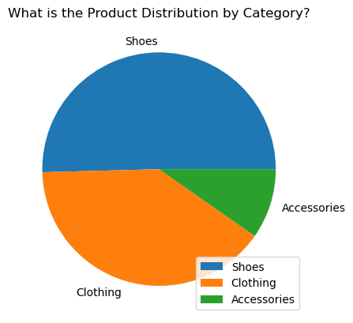
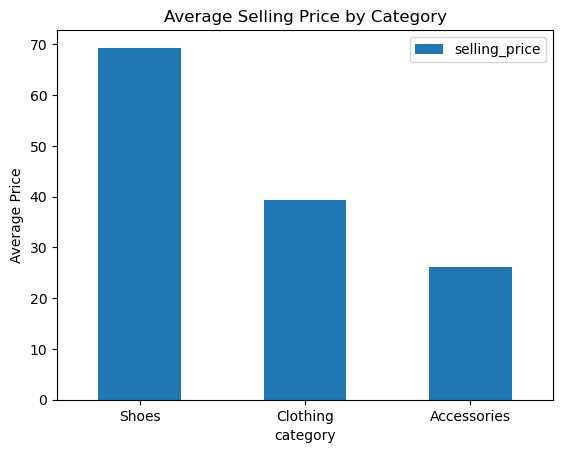
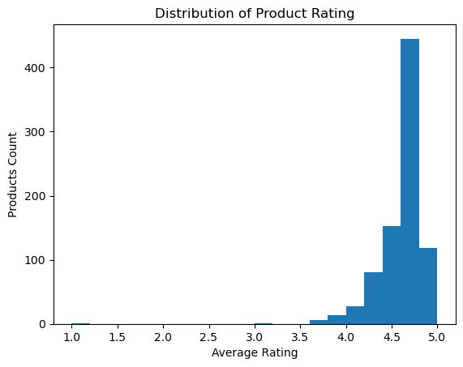
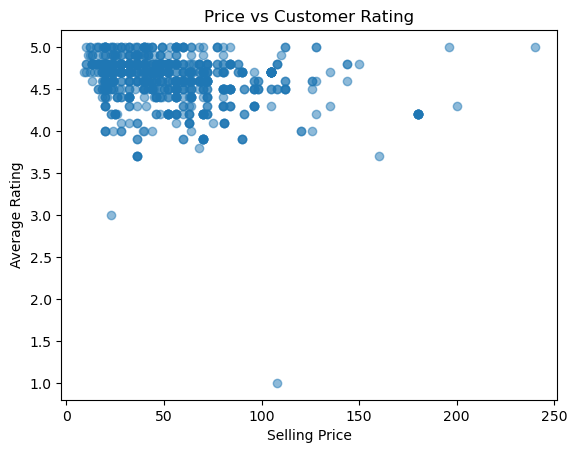

# 📊 Adidas Retail Data Analysis (Python)

## 📌 Introduction

This project explores Adidas retail product from the USA to uncover insights about **product pricing, discount strategies, customer satisfaction and category performance**.

The goal is to understand how **different pricing and promotional strategies influence customer engagement and perception** and to provide **actionable business recommendation**s for retail decision making.

---

## Background
Retail brands like Adidas face complex decisions around pricing, discounting and product promotion.

An understanding on how these factors influence customer satisfaction and engagement is essential for:

* optimizing pricing strategies for different product categories.
* Designing effective discount campaings.
* Improving marketing focus based on customer preferences.
* Ensuring that high-value products reach the right audience.

---

## Business Questions

This analysis seeks to answer the following questions:

1. How are Adidas products distributed across different categories?
2. What is the pricing structure of Adidas products across categories?
3. What is the overall spread of customer satisfaction (ratings)?
4. How do average ratings and review counts vary by product category?
5. How are discounts distributed across categories?
6. Is there a relationship between product price and customer ratings?
7. Which product categories perform best in terms of customer engagement and satisfaction?


---
## 🗂 Dataset Overview

The dataset contains Adidas product information, including:

* Product category
* Original price
* Discounted price
* Discount percentage
* Average customer rating
* Number of customer reviews

The data was provided in raw format and required preprocessing before analysis.

---

## 🔗 Project Files
- 📓 [Analysis Notebook](notebook\adidas.ipynb)
- 📊 [Raw Dataset](csv_files\adidas_usa_raw.csv)

---

## 📁 Project Structure

```
Adidas_Retail_Analysis/
│
├── csv_file/
│   └── adidas_usa_raw.csv      # Main analysis notebook

│
├── notebook/
│   └── adidas.ipynb            # Main analysis notebook

│
├── README.md                   # Raw dataset

```

---

## 🧹 Data Cleaning

Before analysis, the dataset was cleaned to ensure accuracy and consistency.

Key steps included:

* Removing currency symbols (`$`) from price columns
* Converting price columns to numeric data types
* Handling missing and non-finite values
* Standardizing column names
* Validating data types and value ranges

This step ensured the dataset was suitable for analysis and visualization.

---

# 📊 The Analysis
This analysis is divided into two main parts:

*  **Exploratory Data Analysis (EDA):**  
  Focuses on understanding the structure, distribution, and patterns within the dataset.

*  **Insight-Driven Analysis (IDA):**  
  Builds on the EDA findings to explore relationships between variables and extract
  meaningful business insights.

## 🔍 Exploratory Data Analysis (EDA)

EDA focuses on understanding the structure, distributions, and basic patterns in the data.

### 1. How are Adidas products distributed across different categories?

To understand the composition of the dataset, I analyzed the number of products within each category.
This helps identify which categories dominate the product offering and which are less represented.



Here’s the breakdown:

* Some categories contain a significantly higher number of products.

* Other categories are niche, with fewer products available.

* Product distribution is uneven, indicating varied product focus across categories.

### 2. What is the pricing structure of Adidas products across categories?

To examine pricing behavior, I analyzed product prices across categories after cleaning and converting price columns into numeric values.
This provides an overview of price ranges and category-level pricing differences.



Here’s the breakdown:

* Product prices vary widely across categories.

* Some categories consistently fall into higher price ranges.

* Other categories are positioned within more affordable pricing tiers.

### 3. What is the overall spread of customer satisfaction (ratings)?

To assess overall customer sentiment, I analyzed the distribution of customer ratings across all products.
This reveals common satisfaction levels and highlights potential outliers.



Here’s the breakdown:

* Ratings are generally skewed toward higher values, indicating positive customer sentiment.

* Extremely low ratings are relatively uncommon.

* There is some variation, suggesting inconsistent experiences across products.

### 4. How do average ratings and review counts vary by product category?

To compare satisfaction and engagement by category, I calculated the average rating and total review count for each product category.
Ratings represent satisfaction, while review counts act as a proxy for engagement.

|   category    |   average_rating  |   reviews_count   |
|---------------|:-----------------:|------------------:|
| Accessories	|     4.825610	    |     49.292683     |
| Clothing	    |     4.636202	    |     66.810089     |
| Shoes	        |     4.544601	    |     783.014085    |


Here’s the breakdown:

* Some categories show high ratings but low review counts.

* Other categories combine high ratings with strong engagement.

* Review volume varies significantly across categories.

### 5. How are discounts distributed across categories?

To understand promotional behavior, I analyzed the average discount percentage applied within each category.
This highlights how discount strategies differ across product lines.

|   category    | average_discount  |
|---------------|------------------:|
| Accessories	| 22.999975	        |
| Clothing	    | 20.708251	        |
| Shoes	        | 23.418842	        |

Here’s the breakdown:

* Certain categories receive higher average discounts.

* Other categories are discounted less frequently or less aggressively.

* Discount application is not uniform across categories.

## 📈 Insight-Driven Analysis (IDA)

IDA builds on EDA findings to examine relationships and performance implications.

### 6. Is there a relationship between product price and customer ratings?

To evaluate whether price influences customer satisfaction, I examined the relationship between product selling price and customer ratings.
This helps determine whether higher prices are associated with better perceived quality.



Here’s what the analysis shows:

* There is no strong positive relationship between price and ratings.

* Many mid-priced products receive ratings comparable to higher-priced products.

* Customer satisfaction appears to be driven by perceived value rather than price alone.

### 7. Which product categories perform best in terms of customer engagement and satisfaction?

To assess overall category performance, I combined customer ratings and review counts to compare categories holistically.
This provides insight into both satisfaction and demand.

|   category    |   selling_price   |   average_rating  | reviews_count |
|---------------|:-----------------:|:-----------------:|--------------:|
| Shoes	        | 69.35446	        | 4.5446013         | 783.014085    |
| Clothing	    | 39.332344	        | 4.636202	        | 66.810089     |
| Accessories	| 26.195122		    | 4.825610          | 49.292683     |

Here’s the breakdown of category performance:

* Some categories consistently show high ratings and strong engagement.

* Other categories perform well in ratings but lag in engagement.

* Category performance varies, suggesting the need for category-specific strategies.


---

## 🔑 Key Insights
### 1. Customer Satisfaction Is Generally High but Uneven Across Categories

* Most Adidas products receive strong average ratings, indicating overall positive customer satisfaction.

* However, customer engagement (review counts) varies significantly across categories.

* This suggests that while product quality is generally well perceived, customer attention and interaction differ by category.

### 2. Higher Price Does Not Guarantee Higher Ratings

* The relationship between selling price and customer ratings is weak.

* Higher-priced products are not consistently rated better than mid- or lower-priced alternatives.

* This indicates that customers prioritize perceived value and quality, rather than price alone.

### 3. Discounts Increase Customer Engagement

* Products with discounts tend to receive higher numbers of customer reviews.

* This suggests that discounts improve visibility and customer interaction, even when they do not significantly affect ratings.

* Discounts therefore act more as an engagement and traffic driver than a direct indicator of quality.

### 4. Category Performance Varies Significantly

* Some categories combine:

    * High average ratings

    * Strong customer engagement

    * Competitive pricing

* Other categories show good ratings but low engagement, indicating possible visibility or demand challenges.

* This variation shows that category performance is not uniform, and broad strategies may be ineffective.

### 5. Mid-Priced Products Often Deliver Strong Value

* Products in the mid-price range frequently demonstrate:

    * Strong customer ratings

    * High engagement levels

* This suggests that customers perceive these products as offering the best balance between price and quality.

---

## 💼 Business Recommendations
### 1. Adopt Category-Specific Pricing Strategies

* Avoid applying uniform pricing strategies across all categories.

* Categories with strong engagement and satisfaction can sustain premium pricing.

* Categories with lower engagement should be reviewed for price optimization or added value propositions.

### 2. Use Discounts Strategically, Not Aggressively

* Apply discounts to:

    * Increase engagement in underperforming categories

    * Improve visibility for new or slow-moving products

* Avoid over-discounting high-performing categories, as this may reduce perceived value.

### 3. Prioritize Marketing on High-Engagement Categories

* Categories with both:

    * High ratings

    * High review counts 
    should receive greater marketing focus and inventory support.

* These categories reflect strong customer demand and brand trust.

### 4. Improve Visibility for Low-Engagement but High-Rated Products

* Products with strong ratings but low review counts may suffer from limited exposure rather than poor quality.

* Improving placement, promotions, or bundling could increase customer interaction.

### 5. Position Mid-Priced Products as Value Leaders

* Highlight mid-priced products as:

    * “Best value for money”

    * “Customer favorites”

* This strategy aligns pricing and marketing with observed customer behavior and preferences.

---

## 📚 What I Learned
Working on this project pushed me deeper into practical Python than I had gone before, especially around cleaning messy, real-world data and handling issues like data type conversions and missing values. I learned how important structure and hierarchy are in an analysis, from clearly defining business questions, to separating EDA from deeper insight-driven analysis, and then translating results into meaningful insights and recommendations. Beyond the technical side, this project significantly improved my analytical thinking, helping me move from simply generating charts to asking the right questions, interpreting patterns correctly, and explaining findings in a way that makes sense to both technical and non-technical audiences.

---

## 🛠 Tools Used
To perform this analysis, I leveraged the following tools:

* Python
* Pandas
* Matplotlib
* Jupyter Notebook

---

## 🏁 Conclusion
This analysis explored Adidas retail product data to understand pricing behavior, discount strategies, customer satisfaction, and category performance. Through structured data cleaning, exploratory analysis, and insight driven analysis, the project showed that higher prices do not necessarily lead to higher customer satisfaction, discounts play a stronger role in driving engagement than perceived quality, and category performance varies significantly across product lines. Overall, the findings highlight the importance of value perception, category specific strategies, and data driven decision making in retail, demonstrating how analytical insights can support more effective pricing, marketing, and product positioning strategies.